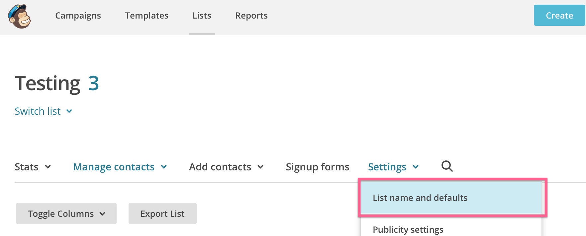
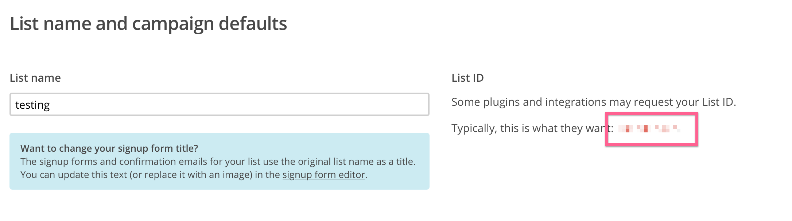
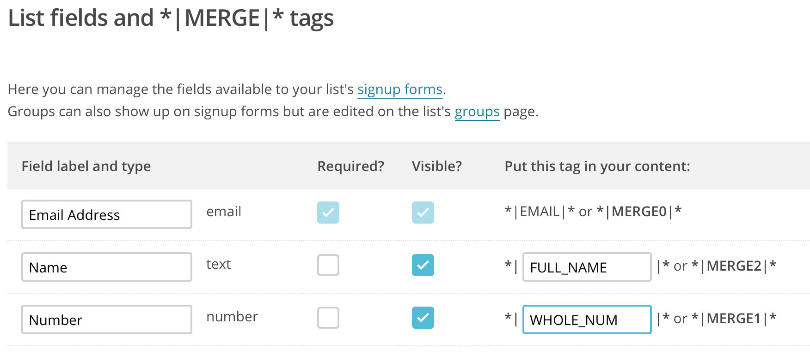
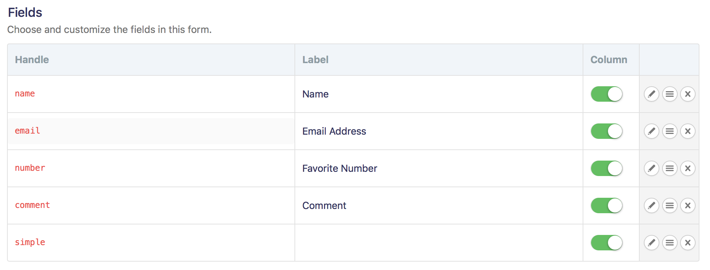
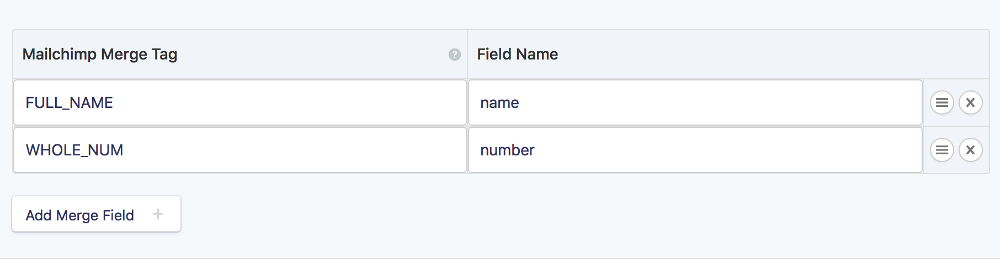

## Installation

1. Copy the "addons" folder contents to your Statamic `site/addons` directory
2. Run `php please update:addons` to load the addon's dependencies.

## Configuration

Configure the addon by visiting CP > Addons > Mailchimp and add:
  * Mailchimp key - from Account - Extras - API Keys
  * If you're going to add folks when they register, turn on Add New Users
  
For both user registration & form submissions:
  * Add a Form for each specific form you'd like added to Mailchimp
  * Mailchimp list id from  & 
  * You can disable the Double Opt In. This is **NOT** recommended and means that they **WILL NOT** get the opt in email. **NOTE**: This may violate privacy laws and may get your banned from Mailchimp
  * Whether or not you want to check permission before add them to a list (this is the first opt in)
    * If so, which user field is the check? The value must be truthy (true, on) when selected otherwise that email willl **NOT** be added to Mailchimp
  * If you want to pass some form information into Mailchimp, use the Merge tags & mapp them to the form field
    * **NOTE**: Mailchimp merge tags are uppercase

## Usage

When a user is registered, they will be automatically subscribed to your mailing list along with any form/merge fields.

When a form is submitted (that is in `formsets`), the `email` field will be used to subscribe to your mailing list, along with any form/merge fields.

## Examples

### Merge Fields

For example if I want the form's 'name' & 'number' sent to Mailchimp, I need to map the tags & fields like so:

## License

[MIT License](http://emd.mit-license.org)

