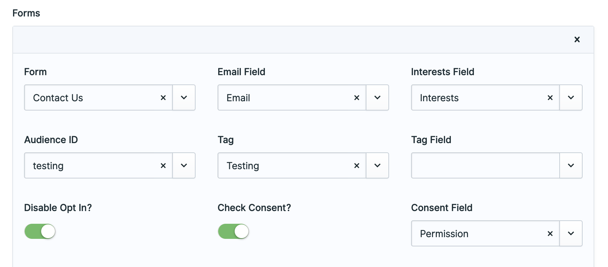
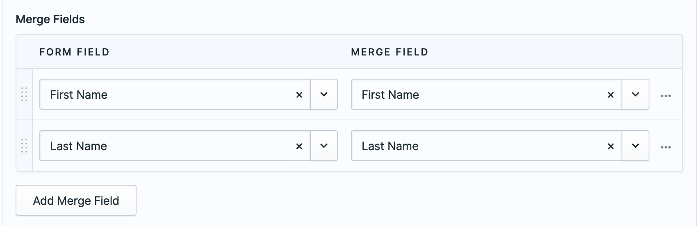

# Manage Mailchimp newsletters in Statamic
[](https://github.com/silentzco/mailchimp/releases)
[](LICENSE.md)

This package provides an easy way to integrate MailChimp with Statamic.

## Requirements

* PHP 7.4+
* Statamic v3

## Installation

You can install this package via composer using:

```bash
composer require edalzell/mailchimp
```

The package will automatically register itself.

## Configuration

Set your Mailchimp API Key in your `.env` file. You can get it from: https://us10.admin.mailchimp.com/account/api-key-popup/.

```yaml
MAILCHIMP_APIKEY=your-key-here
```

To publish the config file to `config/mailchimp.php` run:

```bash
php artisan vendor:publish --provider="Edalzell\Mailchimp\ServiceProvider"
```

This will publish a file `mailchimp.php` in your config directory with the following contents:
```php
return [

    /*
     * If you want to add to your mailchimp audience when a user registers, set this to `true`
     */
    'add_new_users' => false,

    /*
     * The form submissions to add to your Mailchimp Audiences
     */
    'forms' => [
        [

        /*
         * A MailChimp audience id. Check the MailChimp docs if you don't know
         * how to get this value:
         * https://mailchimp.com/help/find-audience-id/.
         */
        'audience_id' => '',

        /*
         * if you need consent before you can subscribe someone, set this to `true`
         */
        'check_consent' => true,

        /*
         * if you're checking for consent, which field is it? Defaults to `'consent'`
         */
        'consent_field' => 'consent',

        /*
         * if you'd like to apply a tag to each member when they submit a particular form
         */
        'tag' => 'Tag One'
        /*
         * handle of the form to listen for
         */
        'form' => '',

        /*
         * See https://mailchimp.com/help/manage-audience-signup-form-fields/ for details on
         * Mailchimp merge fields
         */
        'merge_fields' => [
            [
                /*
                 * The Mailchimp tag
                 */
                'tag'=> '',

                /*
                 * the blueprint field name to use for the merge field
                 */
                'field_name' => ''
            ]
        ],

        /*
         * To have single opt in only, which I don't recommend, set this to `true`.
         * See: https://mailchimp.com/help/single-opt-in-vs-double-opt-in/ for details
         */
        'disable_opt_in' => false

        ]
    ]

You can also configure Mailchimp in the Control Panel




```

## Usage

Create your Statamic [forms](https://statamic.dev/forms#content) as usual. Don't forget to add the consent
field to your blueprint.


## Testing

Run the tests with:
```bash
vendor/bin/phpunit
```

### Changelog

Please see [CHANGELOG](CHANGELOG.md) for more information what has changed recently.

## Contributing

Please see [CONTRIBUTING](CONTRIBUTING.md) for details.

## Security

If you discover any security related issues, please email [addon-security@silentz.co](mailto:addon-security@silentz.co) instead of using the issue tracker.

## License

The MIT License (MIT). Please see [License File](LICENSE.md) for more information.
